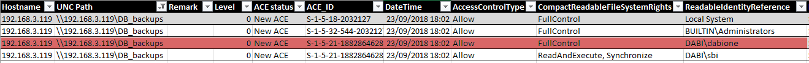
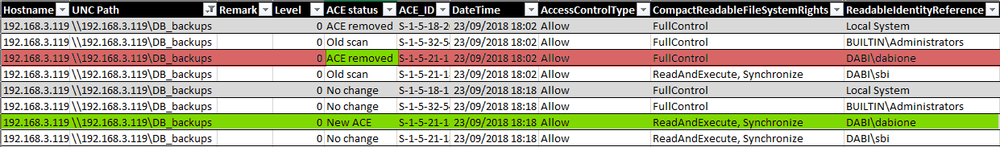
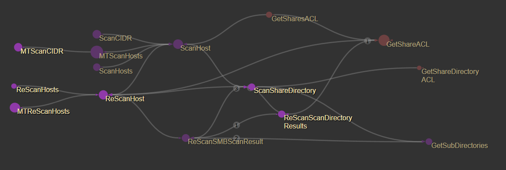

## SharesMapper

SharesMapper is a tool that allows an administrator following up ACL on shares through iterative scans.


The solution contains three projects :
- SMBSharesUtils : library to scan SMB shares
- ReportGenerator : library to generate OpenXML report
- SharesMapperCLI : exe to use previous libraries (should be defined as startup project)
- NFSSharesUtils : TBD


##### Example:

The first scan highlighted a DB_backup share with too permissive ACE :
```
SharesMapperCLI.exe scanSMB -t 192.168.3.0/24 -x lab_range -o lab_range
```


After reporting that to the IT team, you want to ensure that the rights were reviewed correctly:

```
SharesMapperCLI.exe rescanSMB -i .\lab_range_SMBHosts.xml -x lab_range_scan_2 -o lab_range_scan_2
```



## Usage Examples
### Using the CLI
SharesMapper.exe offers the following verbs :

```
SharesMapperCLI.exe --help

  scanSMB         Perform a SMB scan.

  reporter        Generate report of a previous scan.

  rescanSMB       Perform a new scan on previous result.

  getSMBShares    Preview SMB shares of host.

  getACL          Preview target ACL.

  help            Display more information on a specific command.

  version         Display version information.
```

##### scanSMB verb

This perform a SMB scan based on the defined parameters. The following example scan multiple hosts using 2 threads :

```
 SharesMapperCLI.exe scanSMB --target "192.168.3.119 192.168.3.120 192.168.3.121" --recursiveLevel 2 --maxThreads 2 --debug --outData demo_scan --outReport demo_scan
```

To list all parameters for the "scanSMB" verb the "--help" switch on the "scanSMB" verb.


###### Target specification

The target switch accepts multiple targets separated by a space. On every target you can specify a single host, IP, IP range or CIDR or both :

```
 SharesMapperCLI.exe scanSMB --target "192.168.15-20.0/24 192.168.30.0/24 filer.domain.local" --recursiveLevel 2 --maxThreads 2 --debug --outData demo_scan --outReport demo_scan
```

Target can also be a file of host names. In order to use a file, you have to change the target type using the targetType switch :
```
 SharesMapperCLI.exe scanSMB --targetType file --target .\hosts.txt --recursiveLevel 2 --maxThreads 2 --debug --outData demo_scan --outReport demo_scan
```


##### reporter verb
This verb allows the generation of a xlsx report based on a serialized scan result (-x|--outData switch).

```
SharesMapperCLI.exe reporter --scanType SMB -i lab_range_scan_SMBHosts.xml -o lab_range_report
```

If you perform scan using a computer outside the domain (ex. using runas) the sid resolution will not be possible. You can use the -s (--sid) switch to give the program a list of SID, resolution inside a file.
 
```
SharesMapperCLI.exe reporter --scanType SMB -i lab_range_scan_SMBHosts.xml -o lab_range_report -s domaine_B_SID_resolve.txt
```

##### rescanSMB verb
This verb is used to perform a shares scan based on previous result. 

```
SharesMapperCLI.exe rescanSMB -i lab_range_scan_SMBHosts.xml -x lab_range_scan_2 -o lab_range_scan_2
```
It is also possible to enable new shares discovery using the -n (--newshares) switch

```
SharesMapperCLI.exe rescanSMB -i lab_range_scan_SMBHosts.xml -x lab_range_scan_2 -o lab_range_scan_2 -n 
```

Note that the previous command will not discover new hosts. To add new hosts you should use the -a (--appendhosts) or -f (--appendfile) switch.

In this verb, the parameter -r (--recursiveLevel) will affect only the new shares. The previous shares' subdirectories will be rescanned wither their recursive level is greater than the config value or not.


Perform a scan with a recursive level could lead to duplicate entries. The common example is when we scan C$ (C:\) share and ADMIN$ (C:\Windows).
To avoid this double scan of same folder you can use th -b (--blacklist) switch to define a set of shares names to not scan recursively.
```
SharesMapperCLI.exe scanSMB -t localhost -d -x localhost -o localhost -r 1 -b "C$,ADMIN$"
```

You can also give it a file of shares list (one per line):

```
SharesMapperCLI.exe scanSMB -t localhost -d -x localhost -o localhost -r 1 -b .\ignore.txt
```

## Using the DLLs

If you want to integrate the scanner to your project or use it in your PowerShell scripts, you can import the libraries of the projects.
The following examples explain how to use them with PowerShell.


#### SMBSharesUtils DLL
This assembly exports classes and methods to perform SMB shares' ACL scans.

Firstly, the DLL must be loaded : 
```
PS:> Add-Type -Path .\SMBSharesUtils.dll

```

Add-Type documentation : https://docs.microsoft.com/en-us/powershell/module/microsoft.powershell.utility/add-type?view=powershell-6

Once the DLL loaded, you can access all exported methods :
```
PS:> [SMBSharesUtils.SharesScanner] | Get-Member -Static 

Name                       MemberType
----                       ----------
AppendHosts                Method    
Equals                     Method    
GetSubDirectories          Method    
MTReScanHosts              Method    
MTScanCIDR                 Method    
MTScanHosts                Method    
new                        Method    
PreviewHostShares          Method    
ReferenceEquals            Method    
ReScanHost                 Method    
ReScanHosts                Method    
ReScanScanDirectoryResults Method    
ReScanSMBScanResult        Method    
ReScanSMBScanResults       Method    
ScanCIDR                   Method    
ScanHost                   Method    
ScanHosts                  Method    
ScanShareDirectory         Method    
TryResolveHostName         Method    

```

##### Run a simple SMB scan


```
[SMBSharesUtils.SharesScanner]::ScanHost

OverloadDefinitions
-------------------
static SMBSharesUtils.SMBHost ScanHost(string hostname)

[SMBSharesUtils.SharesScanner]::ScanHost("localhost")


hostname             : localhost
ip                   :
scanDateTime         : 25/09/2018 21:12:28
scanRecursiveLevel   : 0
hostSharesScanResult : {[ADMIN$, SMBSharesUtils.SMBScanResult], [C$, SMBSharesUtils.SMBScanResult], [IPC$, SMBSharesUtils.SMBScanResult]}

```

The result is a SMBHost object. 


The exported methods do not offer parameters to setup configuration of the scan, you have to set config values in the Config class.

```
PS:> [SMBSharesUtils.Config]::ShowConfig()

Field                                     Value
--------------------------------------------------
Debug                                     False
MaxThreads                                1
PrintACL                                  False
TryResolveSID                             True
TryResolveHostName                        False
RecursiveLevel                            0
ScanForNewShares                          True
ScanForNewSharesRecusiveLevel             -1
ScanForNewSharesTryResolveHostName        True
ThreadJoinMaxAttempts                     20
ThreadJoinTimeout                         100
```

Setting recursive level to 1 :  
```
PS:> [SMBSharesUtils.Config]::RecursiveLevel = 1
```

In addition to these parameters, the Config class exports a list of strings that contains shares names to not scan recursively :

```
[SMBSharesUtils.Config]::SharesRecursiveScanBlackList = "C$","ADMIN$"
```

###### SMBSharesUtils call graph 




#### ReportGenerator DLL

This assembly export functions to generate reports based on serialized scan result.

```
PS:> Add-Type -Path .\ReportGenerator.dll
PS:> [ReportGenerator.XLSXReport]::GenerateSMBHostsReport

OverloadDefinitions
-------------------
static void GenerateSMBHostsReport(System.Collections.Generic.Dictionary[string,SMBSharesUtils.SMBHost] hosts, string filename)
```

As stated above, you load a SID resolution file using the "--sid" switch. To load the file using Powershell, you have to use LoadSIDResolutionFile :

```
PS:> [ReportGenerator.XLSXReport]::LoadSIDResolutionFile

OverloadDefinitions
-------------------
static bool LoadSIDResolutionFile(string filename)
```


#### Acknowledgment 
SharesMapper contains some snippet from other public projects :

- Well known SIDs and right on ACE 
  - https://github.com/PowerShellMafia/PowerSploit/blob/f94a5d298a1b4c5dfb1f30a246d9c73d13b22888/Recon/PowerView.ps1#L1574 
- NetShareEnum usage and examples 
  - https://www.pinvoke.net/default.aspx/netapi32.NetShareEnum
- Microsoft documentation
  - https://docs.microsoft.com/fr-fr/windows/desktop/SecAuthZ/access-mask
  - https://msdn.microsoft.com/en-us/library/aa394063.aspx
  - https://docs.microsoft.com/fr-fr/windows/desktop/SecAuthZ/access-mask
  - https://technet.microsoft.com/fr-fr/library/bb967286.aspx
